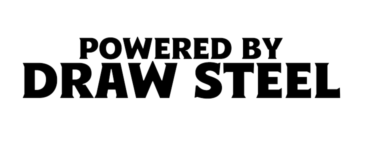

# Draw Steel Director Assistant

A Claude Code plugin for Directors running Draw Steel TTRPG campaigns. Provides narrative-first campaign, arc, session, and encounter design via the `director-assistant` agent and 8 specialized skills.

## A quick word from an actual human

Unlike most of this plugin, this section was actually written be me, a human! Full disclaimer, while I did read and review every single line in this plugin, it was in large part, created by Claude.

So why did I create this plugin? Honestly, it was mostly just to get familiar with Claude; with plugins, agents, skills, and this whole ecosystem. But it was also to help me make better draw steel adventures.

I love TTRPGs. I've been playing D&D for over 15 years and I've been in love with Draw Steel ever since it was announced. I've made my fair share of one-shots, adventures, and even the occasional abandoned campaign. I also realize that there are a lot of "best practices" to remember when creating an adventure (or even a combat). The Draw Steel Heroes rulebook contains a good number of them. I'm not a professional writer or storyteller. I'm just someone who wants to make fun adventures. My hope is that this plugin can help me shape my ideas into something my friends can enjoy (and get a better reaction than just "Yeah... Tonight was fun.")

I get that many people's view of AI is unfavorable, especially when it comes to creative endeavors (like making TTRPG adventures). I am absolutely **not** advocating for having this plugin just create a whole campaign for you and have you take credit for it. The reason this plugin is called director-*assistant* is because that is exactly what it is meant to do; assist you.

If you're the kind of person who has endless, highly detailed, ideas for your players to enjoy week after week, then great! You certainly don't need this plugin. But if you're someone who is trying to balance work and life and really wants to be a Director (or DM), but doesn't want to just have their players fight another bland battle in another generic location while trying to stop a run-of-the-mill BBEG, then I think this plugin can help.

## Installation

```bash
claude plugin install ramcinnes/draw-steel-director-assistant
```

## What's in the box

- **`director-assistant` agent** — orchestrates the four scales of campaign prep (campaign / arc / session / encounter)
- **8 skills** — `campaign-creation`, `arc-creation`, `session-creation`, `combat-encounter`, `social-encounter`, `exploration-encounter`, `npc-creation`, `location-creation`
- **Full Draw Steel reference library** — classes, ancestries, cultures, careers, complications, setting (factions, regions, timeline, cosmology), 293 enemy stat block PNGs

## Usage

In any Claude Code session, ask the director-assistant for help:

> Have the director-assistant create a new campaign called "The Silverhold Affair"

Campaigns are written to `~/draw-steel-campaigns/<campaign-slug>/`.

See the agent's full orchestration flow at [agents/director-assistant.md](agents/director-assistant.md).

## What this plugin does NOT include

- The Draw Steel rulebooks (you need to own these)
- The source PDF used to extract stat block images (the PNG library ships pre-extracted)

## Authoring credit

Built by Robert McInnes.

The Draw Steel Director Assistant Claude Plugin is an independent product published under the DRAW STEEL Creator License and is not affiliated with MCDM Productions, LLC. DRAW STEEL © 2026 MCDM Productions, LLC.

Draw Steel is © MCDM Productions.

